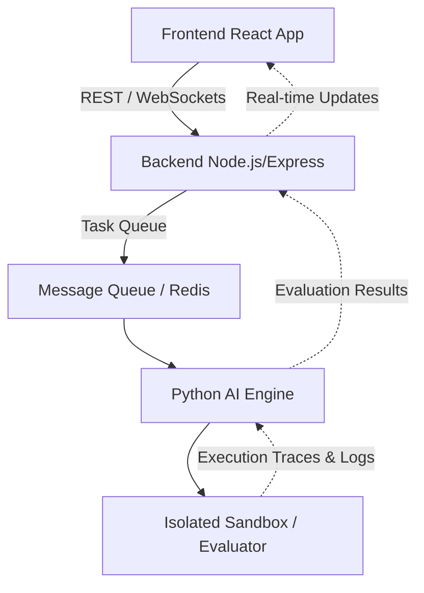

# AgentGuard

AgentGuard is a cutting-edge platform designed to evaluate, secure, and monitor autonomous AI agents. As AI agents gain more agency and autonomy, ensuring their actions are safe, aligned, and effective becomes critical. AgentGuard provides a comprehensive solution for evaluating agent behavior within isolated sandbox environments before they are deployed to production.

## Problem & Solution

### The Problem
Autonomous AI agents can execute code, browse the web, and interact with external systems. Without proper guardrails, they pose significant risks, including:
- Executing malicious or unverified code.
- Hallucinating outputs or taking destructive actions.
- Straying from their intended system prompts or constraints.

### The Solution
AgentGuard acts as a security and evaluation layer for AI agents. It allows developers to:
1. Define tasks and system constraints for agents.
2. Run agents in an isolated sandbox environment.
3. Evaluate their behavior using advanced AI-driven heuristics (e.g., safety, alignment, task completion).
4. Monitor and review detailed execution traces and logs.

## Architecture

AgentGuard is built using a modern, scalable architecture:



- **Frontend**: A React-based dashboard for managing tasks, viewing execution traces, and analyzing evaluation results.
- **Backend**: A Node.js backend that handles API requests, user management, and coordinates tasks.
- **Queue**: A message queue system for managing asynchronous task execution.
- **Python AI Engine**: The core engine that interfaces with the AI agents, passing them tasks and capturing their actions.
- **Sandbox/Evaluator**: An isolated environment (e.g., Docker containers) where agents execute code and interact. The evaluator monitors network traffic, system calls, and outputs to assess safety and performance.

## Local Setup

Follow these instructions to run AgentGuard locally:

### Prerequisites
- Node.js (v18+)
- Python (v3.10+)
- Redis (optional, depending on queue implementation)
- Docker (for sandbox environments)

### 1. Clone the Repository
```bash
git clone https://github.com/your-org/agentguard.git
cd agentguard
```

### 2. Setup Backend
```bash
cd backend
npm install
npm run build
npm start
```

### 3. Setup Frontend
```bash
cd frontend
npm install
npm start
```

### 4. Setup Python AI Engine
```bash
cd ai-engine
python -m venv venv
source venv/bin/activate
pip install -r requirements.txt
python main.py
```

## Known Limitations

- **Sandbox Overhead**: Running agents in fully isolated Docker containers can introduce latency.
- **Evaluator Heuristics**: The AI-driven evaluation heuristics are still under active development and may occasionally produce false positives or negatives.
- **Scalability**: While the architecture is designed to scale, the current local setup is optimized for single-node development and testing. Production deployments require additional orchestration (e.g., Kubernetes).