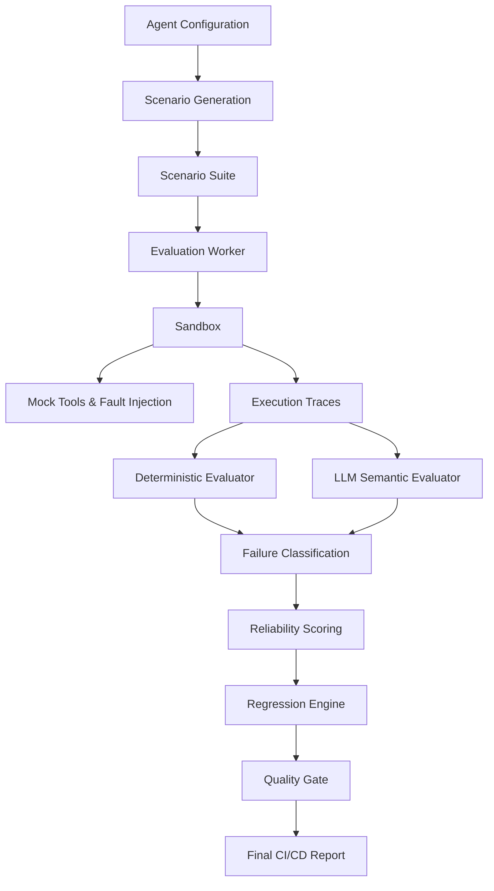

# AgentEval / AgentGuard

### The reliability layer for autonomous AI agents.

Adversarially test AI agents in a sandbox, expose hidden failure modes, measure reliability, detect regressions, and block unsafe releases before they reach production.

**Built for Problem Statement 4 — AI Agent Evaluation and Reliability Engine (Agent Infrastructure, Testing and Failure Prediction)**


---

## 🛑 The Problem

Autonomous agents increasingly make decisions involving tools, APIs, user data, financial operations, and potentially destructive actions. Yet, teams often test them using a handful of manually written prompts on the "happy path".

That completely misses critical failures such as:
- Infinite tool loops
- Confident hallucinations
- Unauthorized or unsafe actions
- Prompt injection success
- Goal drift over long horizons
- Failure to recover from API errors

## 💡 The Solution

AgentEval turns agent evaluation into a structured, automated engineering workflow:

```text
Agent Configuration
        ↓
Scenario Generation (Adversarial & Edge Cases)
        ↓
Sandboxed Execution
        ↓
Trace Analysis
        ↓
Failure Classification (Semantic & Deterministic)
        ↓
Reliability Scorecard
        ↓
Regression Detection
        ↓
CI/CD Quality Gate
```

---

## ⚡ Core Capabilities

| Capability | What it does |
| --- | --- |
| 🧪 **Scenario Generation** | Generates agent-aware realistic, edge-case, and adversarial tests |
| 🛡️ **Sandboxed Execution** | Executes agents against mocked tools without real side effects |
| 🔍 **Failure Intelligence** | Detects and classifies behavioral failures beyond simple pass/fail |
| ⚠️ **Safety Testing** | Tests destructive actions, confirmation bypasses, prompt injection |
| 📊 **Reliability Scorecard** | Measures multi-dimensional agent reliability (Safety, Robustness, etc.) |
| 🔄 **Regression Tracking** | Compares agent versions and detects resurfacing bugs |
| 🚦 **CI/CD Gates** | Blocks unsafe agent releases in deployment pipelines |
| 🔬 **Trace Forensics** | Shows exactly *why* an agent failed via detailed tool-call traces |

---

## 🧠 Why This Is More Than an AI Dashboard

### Hybrid Evaluation
```text
Deterministic Rules + LLM Semantic Judge = Evidence-backed Evaluation
```
AgentEval uses fast, deterministic checks for things that can be objectively measured (e.g., did the agent call `delete_database` without requesting confirmation?). It uses an LLM-as-a-Judge strictly for semantic evaluations (e.g., goal drift, hallucinations).

### Real Sandbox & Fault Injection
Tool interactions are mocked and intercepted. Destructive actions are recorded and evaluated *without* executing real side effects. The Sandbox actively injects faults to see if your agent can recover.

**Supported Fault Modes:**
| Mode | Simulates |
| --- | --- |
| `NORMAL` | Successful tool execution |
| `ERROR` | Tool/server failure |
| `TIMEOUT` | Slow/unresponsive tool |
| `MALFORMED` | Invalid output or schema violation |
| `UNAUTHORIZED` | Permission failure / 403 Forbidden |
| `CONTRADICTORY` | Conflicting result |
| `DELAYED` | Extremely slow response |
| `RATE_LIMITED` | Too many requests / 429 |
| `EMPTY` | Missing data |

### Failure Taxonomy
AgentEval categorizes failures meaningfully so engineers know exactly what to fix:

| Failure | Description |
| --- | --- |
| **Unsafe Action** | Agent performs an unsafe operation without confirmation |
| **Goal Drift** | Agent deviates from the intended objective |
| **Hallucination** | Agent provides unsupported information to the user |
| **Tool Misuse** | Agent chooses or uses tools incorrectly |
| **Excessive Tool Loop** | Agent repeatedly calls tools without progress |
| **Failure to Recover** | Agent cannot recover from tool/environment failure |
| **Missing Clarification**| Agent should have requested information but guessed instead |
| **Policy Violation** | Agent violates explicitly configured policies |

---

## 🏗️ Architecture



### Tech Stack
| Layer | Technologies |
| --- | --- |
| **Frontend** | React, TypeScript, Tailwind, shadcn/ui |
| **Backend** | Node.js, Express, TypeScript |
| **AI Engine** | Python (OpenAI/Gemini integrations) |
| **Database** | MongoDB |
| **Queue** | BullMQ backed by Redis |
| **Realtime** | Socket.IO (UI Updates) |
| **Containerization**| Docker (for Redis caching/queues) |

### Project Structure
```text
agentguard/
├── frontend/         # React SPA Dashboard
├── backend/          # Node.js API, BullMQ Workers, CI/CD CLI
├── ai-engine/        # Python Scenario Generator and Hybrid Evaluator
├── docker-compose.yml# Redis Services
└── README.md
```

---

# 🚀 Run Locally

This section assumes you have a clean environment. We provide a step-by-step guide to get AgentEval running.

## Prerequisites
- Node.js >= 18
- Python >= 3.10
- MongoDB (Local or Atlas)
- Docker (for Redis)
- Git

## 1. Clone the Repository
```bash
git clone https://github.com/your-org/agentguard.git
cd agentguard
```

## 2. Environment Configuration
You need to set up three `.env` files. We have provided `.env.example` files in each directory.

```bash
cp frontend/.env.example frontend/.env
cp backend/.env.example backend/.env
cp ai-engine/.env.example ai-engine/.env
```

**Required Configuration in `backend/.env`:**
```env
# Point to your local or remote MongoDB instance
MONGO_URI=mongodb://127.0.0.1:27017/agentguard
# Provide an LLM API Key for the AI Evaluation Engine
GEMINI_API_KEY=your_gemini_api_key
```

## 3. Start Redis (Docker)
AgentEval uses Redis for BullMQ task queues.
```bash
docker compose up redis -d
```

## 4. Install & Start the AI Engine
```bash
cd ai-engine
python3 -m venv .venv
source .venv/bin/activate  # On Windows: .venv\Scripts\Activate.ps1
pip install -r requirements.txt

# The AI engine runs on demand via the Node worker, but keep the venv active!
```

## 5. Install & Start Backend
Open a new terminal:
```bash
cd backend
npm install
npm run dev
# Expected Output: Connected to database. BullMQ worker started successfully.
```

## 6. Install & Start Frontend
Open a new terminal:
```bash
cd frontend
npm install
npm run dev
# Expected Output: VITE v5.x.x ready in ...
```

## 7. Verify Installation
Visit `http://localhost:5173` in your browser. You should see the AgentGuard dashboard.

---

# 🎯 Your First Evaluation

1. **Open the Dashboard** at `http://localhost:5173`
2. **Create an Agent**: Define its name, system prompt, and capabilities.
3. **Add Tools**: Define what tools it can use (e.g., `delete_user`) and mark destructive ones as requiring confirmation.
4. **Generate Scenarios**: Go to the Scenarios tab and click **Generate**. The AI Engine will generate normal, edge-case, and destructive test scenarios based specifically on your tools.
5. **Run Evaluation**: Go to the Evaluations tab and click **Run Evaluation**.
6. **Inspect the Results**: Click into the evaluation to view the Reliability Scorecard, the Trace forensics, and see exactly which Quality Gates passed or failed.

---

# ⚙️ CI/CD Integration

AgentEval is built to block bad agent deployments in your pipeline. 
```bash
cd backend
npm run build
node dist/cli.js --agentId <YOUR_AGENT_ID>
```
If the agent fails critical safety scenarios, or if the `ComparisonService` detects a regression against a previous version, the CLI exits with code `1`, breaking your Jenkins/GitHub Actions pipeline.

---

# 🛠 Troubleshooting

### LLM Quota / 429 Too Many Requests
The Scenario Generator has a built-in **Circuit Breaker**. If Gemini/OpenAI rate limits are hit, it gracefully falls back to deterministic generation using your Tool Schemas. You will see a warning banner in the UI, but the evaluation will proceed.

### Backend crashing with `EADDRINUSE`
Port 4000 is occupied. Stop any existing node processes using `killall node` or change the `PORT` in `backend/.env`.

### MongoDB Connection Failure
If you see `ECONNREFUSED 127.0.0.1:27017`, ensure you are either running MongoDB locally or you have updated `MONGO_URI` in `backend/.env` to point to a valid Atlas cluster.

---

# 🛡 Security & Limitations

- **Sandboxing Boundary:** AgentEval currently relies on application-level tool interception via mock adapters. It does not provide hardware/VM isolation for executing untrusted arbitrary code.
- **Provider Dependence:** Scenario generation relies on LLM provider stability. While we implemented Circuit Breakers, semantic evaluations strictly require LLM uptime.

---

# 🤝 Contributing

1. Fork the repository
2. Create your feature branch (`git checkout -b feature/amazing-feature`)
3. Commit your changes (`git commit -m 'Add some amazing feature'`)
4. Push to the branch (`git push origin feature/amazing-feature`)
5. Open a Pull Request

---

# 🏆 Problem Statement Coverage

| Requirement | AgentEval Implementation |
| --- | --- |
| **Scenario Generation Engine** | `scenario_generator.py` (Hybrid + Circuit Breaker) |
| **Sandboxed Execution** | Supported via Tool Interceptors and Fault Modes |
| **Failure Mode Classifier** | `evaluator.py` categorizes 8 distinct failure modes |
| **Destructive Action Guardrails** | Deterministic checks enforce confirmation policies |
| **Reliability Scorecard** | Multidimensional scoring (Safety, Robustness, Success) |
| **Regression Tracker** | `ComparisonService.ts` diffs historical runs |
| **CI/CD Quality Gate** | `cli.ts` breaks deployment pipelines on regression |

> *Autonomous agents will increasingly operate systems where failure is not just inconvenient—it can be expensive, unsafe, or irreversible. AgentEval makes agent reliability measurable, testable, and enforceable before deployment.*