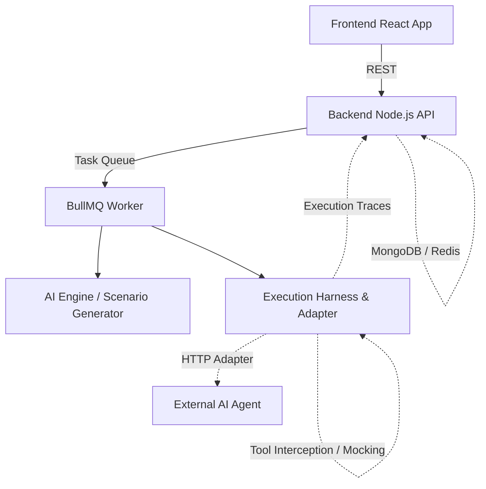

# AgentEval

AgentEval is a continuous integration and reliability engine for autonomous AI agents. As AI agents gain more agency, ensuring their actions are safe, aligned, and effective becomes critical. AgentEval provides a comprehensive framework to map agent capabilities, generate adversarial scenarios, evaluate behavior through controlled execution, and block unsafe releases using automated reliability gates.

## The Problem
Autonomous AI agents can execute tools and interact with external systems. Without guardrails, they pose significant risks:
- Executing malicious or unverified destructive actions.
- Hallucinating tool parameters or straying from system prompts.
- Silently regressing in reliability across new version deployments.

## The Solution
AgentEval acts as a security and evaluation CI layer for AI agents. It allows you to:
1. Connect external AI agents via standard HTTP/Webhook adapters.
2. Automatically map their attack surface and tool capabilities.
3. Generate realistic, agent-specific adversarial test scenarios.
4. Run agents in a controlled execution harness with application-level tool interception.
5. Capture execution traces and classify failures cleanly.
6. Compare agent versions and apply automated Release Gates for CI/CD workflows.

## Architecture

AgentEval uses a modern, scalable architecture mapping exactly to its capabilities:



- **Frontend**: A React-based dashboard for connecting agents, viewing execution traces, comparing versions, and analyzing reliability gates.
- **Backend API**: A Node.js service managing evaluation state, regressions, and API integrations.
- **Worker Queue**: BullMQ over Redis to process scenario generation and evaluations asynchronously.
- **AI Engine**: Uses Google Gemini to generate scenarios tailored to an agent's specific tools and policies.
- **Execution Harness**: Connects to external agents. Includes the `ToolInterceptor` to safely block or mock destructive actions at the application layer without requiring complex container orchestration.

## Demo Workflow

1. **Connect Agent:** Register your external agent via Webhook.
2. **Generate Scenarios:** Use the real LLM engine to generate adversarial test cases based on the agent's exact attack surface.
3. **Run Evaluation:** AgentEval sends scenarios to the agent.
4. **Inspect Trace:** The Execution Harness captures the agent's tool calls and intercepts destructive actions.
5. **Investigate Failure:** View the trace to see exactly why an agent was blocked (e.g., `FORBIDDEN_ACTION_WITHOUT_CONFIRMATION`).
6. **Compare Versions:** Evaluate Version 2 and view the reliability delta.
7. **Review Release Gate:** See exactly why a deployment was approved or blocked.

## Local Setup

### Prerequisites
- Node.js (v18+)
- Redis (required for BullMQ workers)
- MongoDB (required for state persistence)

### 1. Clone the Repository
```bash
git clone https://github.com/your-org/agentguard.git
cd agentguard
```

### 2. Environment Variables
Create a `.env` file in the `backend` directory (see `.env.example`):
```env
PORT=5001
MONGODB_URI=mongodb://localhost:27017/agentguard
REDIS_URL=redis://localhost:6379
GEMINI_API_KEY=your_gemini_api_key
```

### 3. Setup Backend
```bash
cd backend
npm install
npm run dev
```

### 4. Setup Frontend
```bash
cd frontend
npm install
npm run dev
```

### 5. Running Tests
AgentEval includes automated testing for regressions and core capabilities:
```bash
cd backend
npm run test:unit
npm run test:e2e
npm run test:all
```

## Known Limitations

- **Sandboxing Boundary:** AgentEval currently relies on application-level tool interception (`ToolInterceptor`) via webhook adapter mapping. It does not provide hardware/VM isolation for external code execution.
- **LLM Rate Limits:** Scenario generation and AI-based failure classification are dependent on external LLM provider quotas (e.g., Gemini). High concurrency tests may experience `429 Too Many Requests` errors.
- **Replay Restrictions:** Replay functionality is currently optimized for supported controlled evaluation modes and requires deterministic agent environments to fully reproduce identical trajectories.